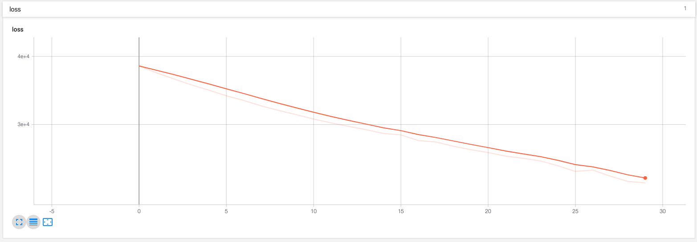

# transformer_network_tensorflow
Tensorflow implementation of transformer network

You can learn more about the code by reading my blogs [part 1](https://medium.com/datadriveninvestor/lets-build-attention-is-all-you-need-1-2-de377cebe22) and [part 2](https://medium.com/datadriveninvestor/lets-build-attention-is-all-you-need-2-2-11d9a29219c4). This will give you the idea why and how the code is written. For following with the same and understanding the code [tutorial](./use_cases/tutorial) would be a good start, however note that it is writte for easy understanding and it not the optimal implementation.

**NOTE: This is a ported model working on my desktop but it has not been tested on the machien I am using to push this code.**

The reason this is a good implementation / hack is because this is 100% functional in design, i.e. there are no f0kcin classes, which is a huge benefit, making it easier to maintain and use and reproduce.

## Usage

For using the network prefer to go for [`transformer`](./transformer), it has a much more stable and scalable parts of code. In beam-search I have removed the caches as felt too clunky and difficult to use. To test the network run the command
```bash
python3 simple_trainer.py --mode=1
```

And it decodes properly as well, sample decode below:
```
seq: [[[ 3 14 14 14  8 10  8 10 10  8 10 14  0  7  7  7  7  2]
       [ 3 14 14 14  8 10  8 10 14  8 10 14  2  0  0  0  0  0]
       [ 3 14 14 14  8 10  0  7  0  8 10 14  2  0  0  0  0  0]
       [ 3 14 14 14  8 10  8 10 10  8 10 14  2  0  0  0  0  0]
       [ 3 14 14 14  8 10  0  7  0  8  2  0  0  0  0  0  0  0]
       [ 3 14 14 14  8 10  8 10  2  0  0  0  0  0  0  0  0  0]
       [ 3 14 14 14  8 10  8  2  0  0  0  0  0  0  0  0  0  0]]
```

### Translation

Now to the main problem that is translation, for quick check I have used the [Canadian Hansard dataset](https://catalog.ldc.upenn.edu/LDC95T20). You need to download this to an appropriate folder and run `cleaner.py` script which generates the required files, however I have already provided the data in `data` folder. So you'll need to modify the `cleaner.py` script to suit your needs. Once done it will generate a `sentencepiece` encoder/decoder model which we will use for handling text.

Then you need to run the script `lang_trainer.py` and it will work it's magic writing logs and saving the model, or alternatively use the `enfr.sh` file. Here is a sample of what it can translate, [file](./data/samples.txt): 

```text
================= EPOCH 0 =================
---- SOURCE (trunc-5h): Debates of the Senate (Hansard) 2nd Session, 36th Parliament,
Volume 138, Issue 14 Wednesday, December 1, 1999 The Honourable Rose-Marie Losier-Cool,
Speaker pro tempore Table of Contents SENATORS' STATEMENTS World AIDS Day The Francophonie
RCMP Inspector Robert Upshaw Tribute on Promotion ROUTINE PROCEEDINGS Canadian District of
the Moravian Church of America Private Bill to Amend Act of Incorporation-Presentation of
Petition The Estimates, 1999-2000 Notice of Motion to Authorize National Finan
---- TARGET (trunc-5h): Débats du Sénat (hansard) 2e Session, 36e Législature, Volume 138,
Numéro 14 Le mercredi 1 er décembre 1999 L'honorable Rose-Marie Losier-Cool, Président pro
tempore Table des matières DÉCLARATIONS DE SÉNATEURS La Journée mondiale du sida La
Francophonie L'inspecteur Robert Upshaw de la GRC Hommages à l'occasion de sa promotion
AFFAIRES COURANTES Section canadienne de l'Église morave d'Amérique
Projet de loi d'intérêt privé modifiant la Loi constituant en personne morale- Présentation d'une péti
>>> PRED: di sénatdidi'di'dididi'cdididi'didididididicdidi'di'di'di'dididididi'di'didi'didi'di'di
''di'dididi' i'di'didi'di'di'didididi'didi'didididi'dididi'dier'di''didi'di'di'didi
>>> PRED: di sénatdidi'di'dididi'cdididi'didididididicdidi'di'di'di'dididididi'di'didi'didi'di'di'
'di'dididi' i'di'didi'di'di'didididi'didi'didididi'dididi'dier'di''didi'dicdi'didi

================= EPOCH 9 =================
---- SOURCE (trunc-5h): Debates of the Senate (Hansard) 1st Session, 36th Parliament, Volume
137, Issue 28 Tuesday, December 9, 1997 The Honourable Gildas L. Molgat, Speaker Table of
Contents Pages Exchange Program with House of Commons SENATORS' STATEMENTS The Senate
Response to Newspaper Article on Senator's Residency Qualifications History of the Vote in
Canada Book Launched by Governor General ROUTINE PROCEEDINGS Report of Committee Income Tax
Conventions Implementation Act, 1997 Report of Committee Present State a
---- TARGET (trunc-5h): Débats du Sénat (hansard) 1ère Session, 36e Législature, Volume 137,
Numéro 28 Le mardi 9 décembre 1997 L'honorable Gildas L. Molgat, Président Table des matières
Le programme d'échange de pages avec la Chambre des communes DÉCLARATIONS DE SÉNATEURS Le
Sénat Réponse à un article de journal sur les conditions de résidence applicables à un
sénateur L'histoire du vote au Canada Le lancement du livre par le Gouverneur général
AFFAIRES COURANTES Rapport du comité Loi de 1997 pour la mise en oeuvre de
>>> PRED: débats du sénat (hansard) 1ère session, 36 ', volume 137, sénat, numéro 1 1, num l'
137, numéro l' table des l'honorable gildas l', sénatss, président table des matières num l'
l' session, num l'honorable gilhansard matières num l'das l's président table des matières
président table l's de l'honorable gil le l'e'honorable l
>>> PRED: débats du sénat (hansard) 1ère session, 36 ', volume 137, sénat, numéro 1 1, num l'
137, numéro l' table des l'honorable gildas l', sénatss, président table des matières num l'
l' session, num l'honorable gilhansard matières num l'das l's président table des matières
président table des matières de l'honorable gil le l'honorable'honorable l
```



## More

There is a block added for noam scheme as in the paper, however I have not used it (tiny dataset not needed). Also through out the code you can will see tonnes to prints commented out, those can be helpful if you are trying to debug the model.

## Credits

There was severe limitation in understanding code from different places so I took what I found the best and easiest of their code and merged it:
* [OpenAI](https://github.com/openai/gpt-2) for just how simple and powerful their code is.
* [Tensor2Tensor](https://github.com/tensorflow/tensor2tensor), home of the transformer. Picked up beam-decoding from here, all credits to them. As it turns out copying their code by typing eveyrthing is a great way to learn.
* [Kyubyong](https://github.com/Kyubyong) I mean who hasn't learned from and used his code.
